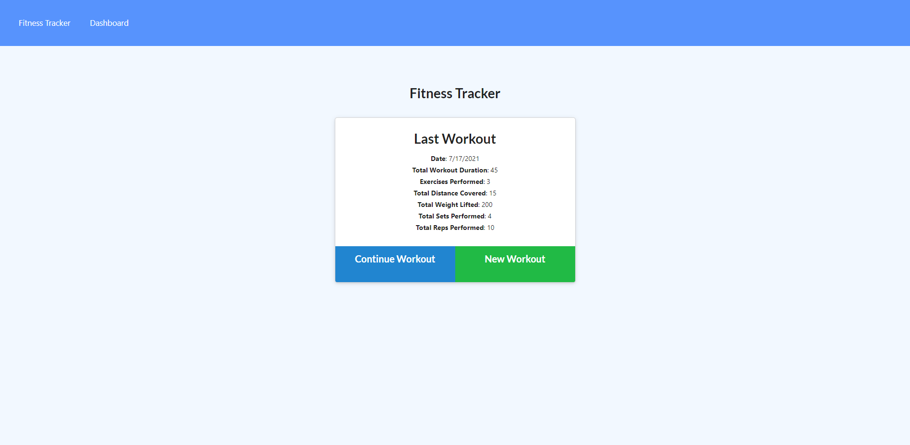
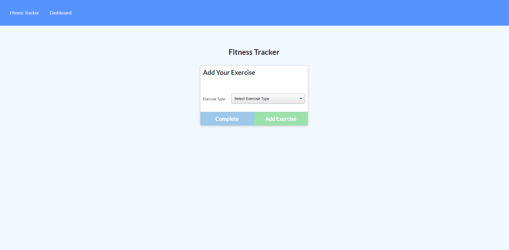
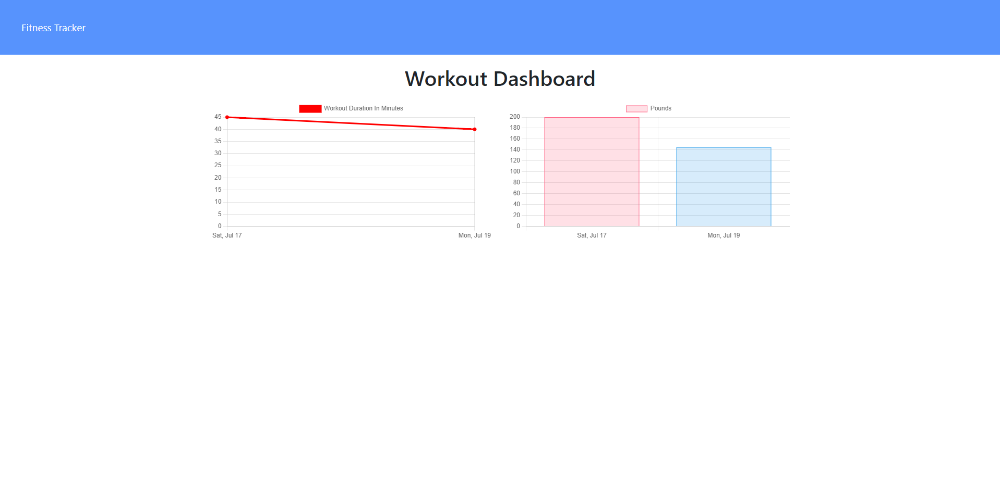

# workout-tracker

## Summary:

For this project, the front-end code was provided on the source code. Only the back-end code contained in the server.js and models.js file was built to support the front-end functionality for the Workout Tracker application.

The back-end (server.js) was built to handle the different paths and user interactions specified in the requirements.

## Path supported by the Back-end (server.js):

1. GET "*" - Handles all non-supported paths and renders the index.html file.
2. GET "/" - Handles the root route rendering the index.html file.
3. GET "/stats" - Handles the stats path rendering the stats.html file.
4. GET "/exercise" - Handles the exercise path rendering the exercise.html file.
6. GET "/api/workouts" - Retrieves all the workouts saved in the MongoDB database.
7. POST "/api/workouts" - Creates a new workout in the MongoDB database.
8. PUT "/api/workouts/:id" - Updates a workout by ID adding exercises to the workout in the MongoDB database.
9. GET "/api/workouts/range" - Retrieves all the workouts saved in the MongoDB database, sorts the information, trims the result to 7 items, calculates the total duration per workout, adds the totalDuration property to the workout objects, and sends the information required to populate the graphs in the stats page.

## Deployed App Link:

[Workout Tracker APP](https://lit-earth-52537.herokuapp.com/)

## Images:

1. Home Page

2. Exercise Page

3. Stats Page

